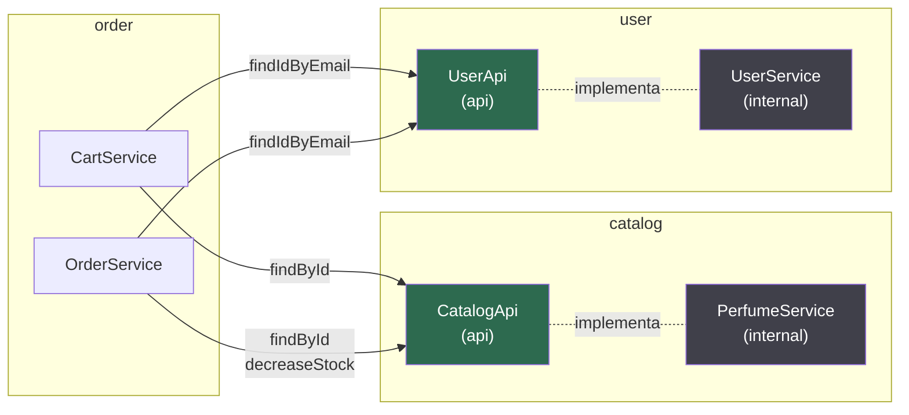

# PerfumeShop API

API REST de comercio electrónico para una tienda de fragancias, construida como monolito modular con Spring Boot 4 y Java 21.

## Stack tecnológico

- **Java 21** + **Spring Boot 4.0.7** (Spring Security 7)
- **PostgreSQL 16** (Docker) con **Flyway** para migraciones
- **Spring Data JPA**, **MapStruct**, **Lombok**
- **JWT** (jjwt 0.12.6) para autenticación
- **springdoc-openapi** (Swagger UI)
- **Maven**

## Arquitectura

Monolito modular: una sola aplicación desplegable, dividida internamente en tres módulos de negocio (`catalog`, `user`, `order`) más dos paquetes de soporte (`config`, `shared`). Cada módulo separa su **API pública** (`api/`) de su **implementación** (`internal/`).

### Estructura de paquetes

```
com.fabio.perfumeshop_api
│
├── catalog/
│   ├── api/
│   │   ├── CatalogApi                 Interfaz pública del módulo
│   │   ├── CatalogItem                DTO expuesto a otros módulos
│   │   └── InsufficientStockException
│   └── internal/
│       ├── Perfume                    Entidad JPA
│       ├── PerfumeRepository
│       ├── PerfumeService             Implementa CatalogApi
│       ├── PerfumeController          /api/perfumes
│       ├── PerfumeMapper
│       ├── CreatePerfumeRequest / PerfumeResponse
│       └── CatalogExceptionHandler
│
├── user/
│   ├── api/
│   │   └── UserApi                    Interfaz pública del módulo
│   └── internal/
│       ├── User                       Entidad JPA
│       ├── Role                       Enum (USER, ADMIN)
│       ├── UserRepository
│       ├── AuthService                Registro y login
│       ├── UserService                Implementa UserApi
│       ├── AuthController             /api/auth
│       ├── JwtService                 Genera y valida tokens
│       ├── JwtAuthFilter              Intercepta cada petición
│       ├── AppUserDetailsService
│       ├── PasswordConfig             Bean BCrypt
│       └── UserExceptionHandler
│
├── order/
│   └── internal/
│       ├── Cart / CartItem            Entidades del carrito
│       ├── Order / OrderItem          Entidades del pedido
│       ├── OrderStatus                Enum (PENDING, PAID, CANCELLED)
│       ├── CartRepository / OrderRepository
│       ├── CartService               Lógica del carrito
│       ├── OrderService              Checkout, pago, historial
│       ├── CartController            /api/cart
│       ├── OrderController           /api/orders
│       ├── CartMapper / OrderMapper
│       └── OrderExceptionHandler
│
├── config/
│   └── SecurityConfig                Cadena de filtros y reglas de acceso
│
└── shared/
    └── GlobalExceptionHandler        Validación + catch-all
```

Las clases de cada `internal/` son **package-private**: el compilador de Java impide que un módulo acceda a las tripas de otro. Solo lo declarado en `api/` es visible desde fuera.

### Comunicación entre módulos

Los módulos se comunican **exclusivamente** a través de las interfaces públicas del paquete `api/`. El módulo `order` depende de `CatalogApi` y `UserApi`, pero nunca de sus implementaciones concretas ni de sus entidades.



Además, **ninguna relación JPA cruza las fronteras entre módulos**: las referencias se guardan como identificadores simples (`Long`), no como relaciones `@ManyToOne`. Por eso `cart_items.perfume_id` no tiene clave foránea hacia `perfumes` — la integridad la garantiza el código validando contra `CatalogApi`, no la base de datos. Esto mantiene los módulos desacoplados también a nivel de persistencia.

### Capas dentro de cada módulo

Cada módulo sigue el mismo patrón por capas: el **controller** traduce HTTP y delega; el **service** contiene la lógica de negocio y las transacciones; el **repository** habla con la base de datos; los **mappers** convierten entre entidades y DTOs. La lógica nunca vive en el controller.

## Módulos

- **catalog** — Catálogo de perfumes con CRUD (escritura solo para ADMIN). Expone `CatalogApi` (`findById`, `decreaseStock`).
- **user** — Registro, login con JWT y roles (`USER` / `ADMIN`). Contraseñas cifradas con BCrypt. Expone `UserApi` (`findIdByEmail`).
- **order** — Carrito de compra, checkout transaccional (descuenta stock y congela precios), pago simulado e historial de pedidos.

## Seguridad

Autenticación sin estado con JWT. La consulta del catálogo es pública; la escritura requiere rol ADMIN; el carrito y los pedidos requieren usuario autenticado. El id del usuario se obtiene del token, no de la URL, garantizando que nadie accede a recursos de otro.

## Endpoints

| Método | Ruta | Descripción |
|--------|------|-------------|
| POST | `/api/auth/register` | Registrar usuario |
| POST | `/api/auth/login` | Login (devuelve JWT) |
| GET | `/api/perfumes` · `/{id}` | Consultar catálogo (público) |
| POST · PUT · DELETE | `/api/perfumes` | Gestionar catálogo (ADMIN) |
| GET · POST · PUT · DELETE | `/api/cart` · `/items` | Gestionar carrito |
| POST | `/api/orders/checkout` | Confirmar compra |
| POST | `/api/orders/{id}/pay` | Pagar pedido |
| GET | `/api/orders` | Historial de pedidos |

## Puesta en marcha

```bash
docker compose up -d      # PostgreSQL
mvn spring-boot:run       # arranca la app (Flyway crea el esquema)
```

API en `http://localhost:8080` · Swagger en `/swagger-ui.html`.

Las credenciales y el secreto JWT se leen de variables de entorno (`DB_USER`, `DB_PASSWORD`, `JWT_SECRET`) con valores por defecto para desarrollo. Para crear un administrador se promociona un usuario en la base de datos y se vuelve a iniciar sesión:

```sql
UPDATE users SET role = 'ADMIN' WHERE email = 'tu@email.com';
```

## Decisiones de diseño

- DTOs inmutables (`record`); nunca se expone la entidad JPA.
- `BigDecimal` para el dinero.
- Flyway es dueño del esquema; Hibernate solo valida.
- Los pedidos congelan nombre y precio en el momento de la compra (registro histórico inmutable).
- Errores con `ProblemDetail` (RFC 7807); cada módulo maneja sus excepciones.

## Estado

Implementado: catálogo, usuarios y pedidos completos. Pendiente: tests, frontend y pulido menor.
